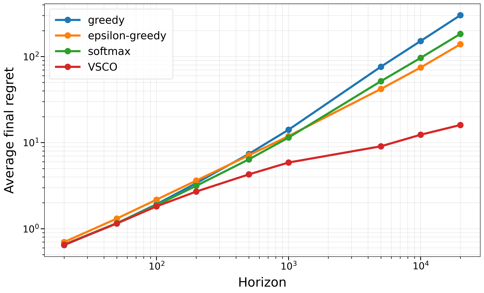
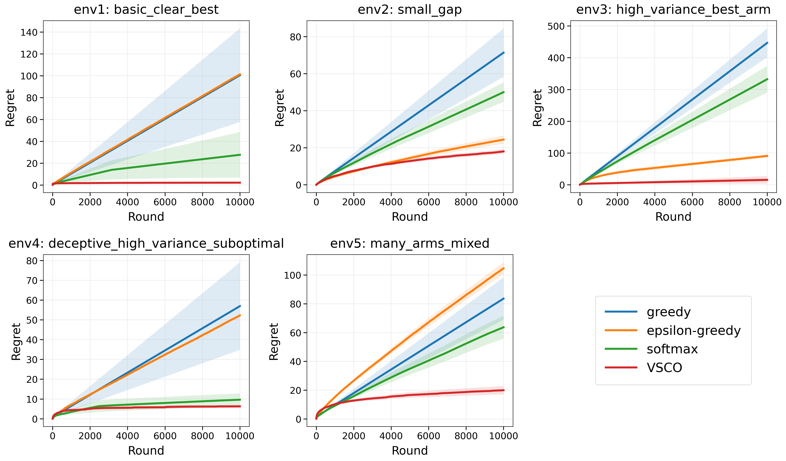

# VSCO: A Variance-Scaled Confidence-Overlap Strategy for Multi-Armed Bandits

A lightweight confidence-style bandit strategy that achieved strong empirical regret.

## Report

You can view the report in the [document viewer](https://hoonably.github.io/cse-archive/vsco/).

VSCO uses:
- variance-scaled confidence bonuses,
- confidence-overlap pruning,
- short horizon-aware warm-up,
- empirical mean and variance estimates.

---

## Regret Plots

<p align="center">
  
  
</p>

---

## Results

| Environment | VSCO | Best baseline | Best baseline method |
| --- | ---: | ---: | --- |
| `env1_basic_clear_best` | **2.100** | 100.610 | Softmax |
| `env2_small_gap` | **15.485** | 23.399 | Epsilon-greedy |
| `env3_high_variance_best_arm` | **2.698** | 75.130 | Epsilon-greedy |
| `env4_deceptive_high_variance_suboptimal` | **4.096** | 24.912 | Softmax |
| `env5_many_arms_mixed` | **22.496** | 40.036 | Softmax |
| **Average** | **9.375** | 52.817 | Per-env. best |

---

## How to Reproduce

```bash
conda env create -f environment.yml
conda activate vsco
````

```bash
python evaluate_public.py
python plot_regret.py
```

---

## Files

```text
algorithms_vsco.py   # VSCO implementation
report.pdf           # Short report
evaluate_public.py   # Public evaluation
plot_regret.py       # Regret plots
public_envs.py       # Public environments
bandit_core.py       # Core bandit utilities
```
