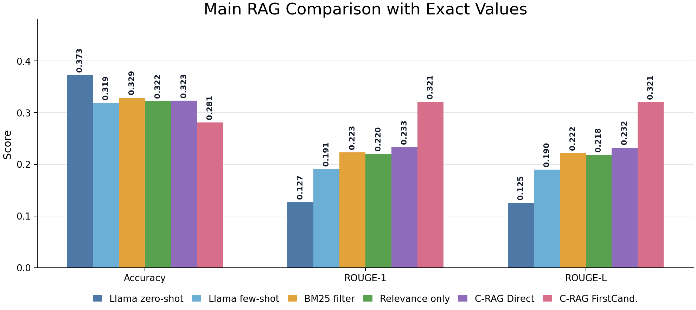
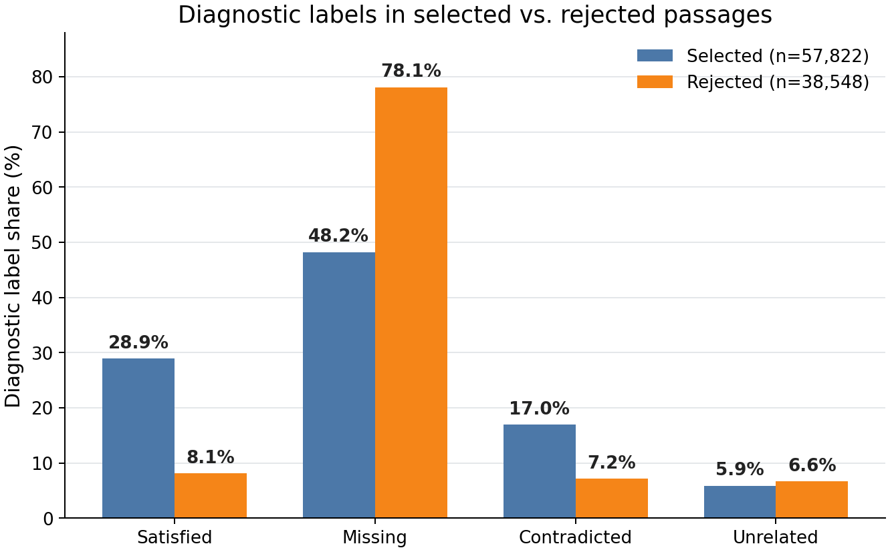

# ConstraintRAG

Project Page: https://jeonghoonpark.com/project/constraint-rag

ConstraintRAG is a constraint-aware retrieval-augmented QA pipeline for Natural Questions. It retrieves BM25 passages, builds lightweight question/evidence diagnostics, reranks evidence with constraint signals, and generates answer candidates with an instruction-tuned Llama model.

<p align="center">
  
  
</p>

The left figure summarizes full-dev RAG accuracy and ROUGE with exact values. The right figure shows that selected passages contain far more satisfied diagnostic constraints than rejected passages, which is the core evidence-management signal used by ConstraintRAG.

The final implementation reports several outputs because they answer different evaluation questions:

- `ConstraintRAG-Direct`: direct short-answer generation from constraint-selected passages. This is the primary single-answer proposed variant.
- `ConstraintRAG-FirstCandidate`: first generated answer candidate only. This gives the strongest ROUGE among concise variants.
- `ConstraintRAG-Candidates`: generated candidate list before evidence candidates. This measures answer coverage.
- `ConstraintRAG-Recall`: full generated/evidence candidate output. This maximizes subspan exact-match recall but is not a user-facing concise answer.

## Method

1. Retrieve top-k passages using BM25/Pyserini.
2. Decompose the question into lightweight constraints.
3. Diagnose each retrieved passage against the constraints.
4. Combine BM25 and diagnostic signals to choose final evidence passages.
5. Generate either a direct short answer or a ranked candidate list.
6. Evaluate concise, candidate, and recall-oriented outputs separately.

## Repository Layout

| Path | Description |
|---|---|
| `main.ipynb` | Training, evaluation, ablation, hard-negative testing, and packaging notebook. |
| `constraint_rag.py` | ConstraintRAG implementation and candidate/evidence parsing helpers. |
| `proposal_baselines.py` | BM25FilteredRAG and RelevanceOnlyRAG comparison baselines. |
| `extra_experiments.py` | Shared metric/output helpers, scratch baselines, hard-negative retriever. |
| `model.py` | Custom GPT-style Transformer for default training tasks. |
| `model_rag.py` | Default retrieval-augmented generation wrapper. |
| `dataset/` | Dataset utilities for pretraining, summarization, classification, and RAG. |
| `utils/` | Metrics, logging, and retrieval helpers. |

## Setup

Create and activate a Python 3.12 conda environment:

```bash
conda create -n cse402 python=3.12
conda activate cse402
```

Install Jupyter, PyTorch, and project dependencies:

```bash
pip install notebook
pip install torch torchvision torchaudio
pip install faiss-cpu pyserini wget transformers datasets "accelerate[torch]" evaluate absl-py nltk rouge_score
```

### Windows Submission Note

The submission helper may call `zip`, which is not available on Windows by default. If the helper script fails because `zip` is missing, install a zip CLI or manually package the Python files.

Pyserini requires Java. After setup, verify the environment:

```bash
python -c "from pyserini.index.lucene import Document; from pyserini.search.lucene import LuceneSearcher; print('pyserini ok')"
```

For local GPU evaluation, start Jupyter with a selected GPU:

```bash
CUDA_VISIBLE_DEVICES=<gpu_id> jupyter lab --no-browser --port=<port>
```

For Llama-based RAG evaluation, authenticate with Hugging Face before running the relevant notebook cells:

```bash
hf auth login
```

## Notebook Flags

The notebook is controlled by boolean flags near the top of `main.ipynb`.

| Flag | Meaning |
|---|---|
| `DO_PRETRAIN` | Run default language-model pretraining. |
| `DO_FINETUNE_SM` | Run summarization finetuning/evaluation. |
| `DO_FINETUNE_CF` | Run classification finetuning/evaluation. |
| `DO_FINETUNE_RAG` | Run default small-model RAG finetuning/evaluation. |
| `DO_ZEROSHOT_RAG` | Run Llama zero-shot RAG baseline. |
| `DO_FEWSHOT_RAG` | Run Llama few-shot RAG baseline with two in-prompt QA examples. |
| `DO_CONSTRAINT_RAG` | Run ConstraintRAG-Direct, ConstraintRAG-FirstCandidate, ConstraintRAG-Candidates, ConstraintRAG-Recall, and ablation variants. |
| `DO_PROPOSAL_BASELINES` | Run BM25FilteredRAG and RelevanceOnlyRAG. |
| `DO_SCRATCH_DOWNSTREAM_BASELINES` | Run no-pretraining downstream comparisons. |
| `DO_HARD_NEGATIVE_RAG` | Run injected BM25 hard-negative robustness experiments. |
| `DO_SUBMISSION` | Package code and supplementaries into zip files. |

The latest fair comparison uses `max_new_tokens=32` for concise Llama-based generation, including zero-shot and two-example few-shot prompting, and `final_top_k=3` for passage-filtering methods.

## Full Dev-Set Results

All RAG results use the full NQ dev set with `num_samples = 6515`. Accuracy is normalized subspan exact match.

| Method | Acc. | R-1 | R-2 | R-L | Role |
|---|---:|---:|---:|---:|---|
| Llama zero-shot RAG | 0.3727 | 0.1268 | 0.0650 | 0.1254 | Strongest concise subspan exact-match, but often verbose. |
| Llama few-shot RAG | 0.3191 | 0.1912 | 0.1027 | 0.1896 | Two-example prompt-based RAG baseline. |
| BM25FilteredRAG | 0.3288 | 0.2231 | 0.1259 | 0.2215 | Sparse filtering baseline. |
| RelevanceOnlyRAG | 0.3225 | 0.2199 | 0.1215 | 0.2179 | LLM relevance filtering baseline. |
| **ConstraintRAG-Direct** | 0.3229 | 0.2333 | 0.1307 | 0.2321 | Primary direct short-answer variant. |
| ConstraintRAG-Direct k2 | 0.2887 | 0.2222 | 0.1267 | 0.2215 | Direct final_k=2 ablation. |
| ConstraintRAG-FirstCandidate | 0.2809 | **0.3212** | **0.1846** | **0.3205** | First-candidate variant with strongest ROUGE. |
| ConstraintRAG-Candidates | 0.3863 | 0.1155 | 0.0472 | 0.1143 | Candidate-list coverage analysis. |
| ConstraintRAG-Recall | **0.4562** | 0.0296 | 0.0113 | 0.0289 | Full candidate/evidence recall analysis. |

These results show a trade-off. The two-example Llama few-shot baseline improves ROUGE over zero-shot but lowers exact-match accuracy. ConstraintRAG-Direct is competitive with filtering and few-shot baselines and improves ROUGE. The Direct k2 ablation is lower, so the primary direct setting uses `final_k=3`. `ConstraintRAG-FirstCandidate` maximizes lexical alignment. The recall variant captures many more answer spans, but its output is too long for concise QA.

## Hard-Negative Robustness

Hard-negative evaluation injects lower-ranked BM25 hits into the top-k retrieval set.

| Method | Acc. | R-1 | R-2 | R-L |
|---|---:|---:|---:|---:|
| BM25FilteredRAG-HardNegative | 0.2881 | 0.2016 | 0.1056 | 0.2002 |
| RelevanceOnlyRAG-HardNegative | 0.3042 | 0.2139 | 0.1166 | 0.2125 |
| ConstraintRAG-HardNegative | 0.2407 | 0.2817 | 0.1534 | 0.2809 |
| ConstraintRAG-HardNegative-Direct | 0.2870 | 0.2180 | 0.1177 | 0.2170 |
| ConstraintRAG-HardNegative-Recall | 0.4284 | 0.0283 | 0.0106 | 0.0276 |

## Artifacts

| Artifact | Description |
|---|---|
| `output/results/*.json` | Score files for default baselines, proposal baselines, ConstraintRAG variants, hard-negative experiments, and summaries. |
| `output/results/*_output.txt` | Full dev-set predictions for qualitative analysis. |
| `defaultproject_code.zip` | Code submission zip created by the notebook packaging cell. |
| `defaultproject_supplementaries.zip` | Supplementary logs, outputs, and result files created by the notebook packaging cell. |

In the supplementaries zip, the notebook's `output/results/` files are packaged under a root-level `results/` directory.
