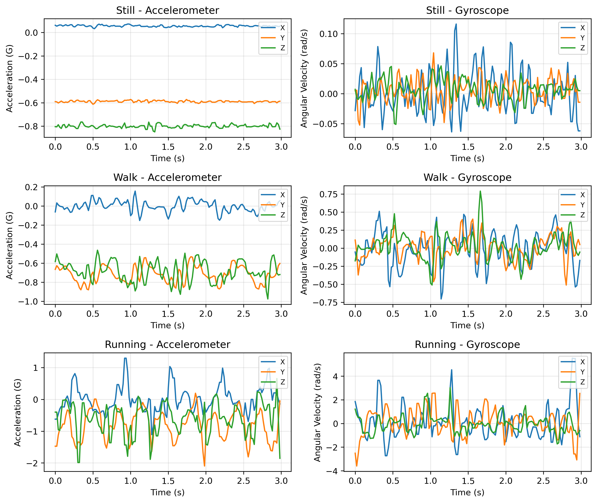
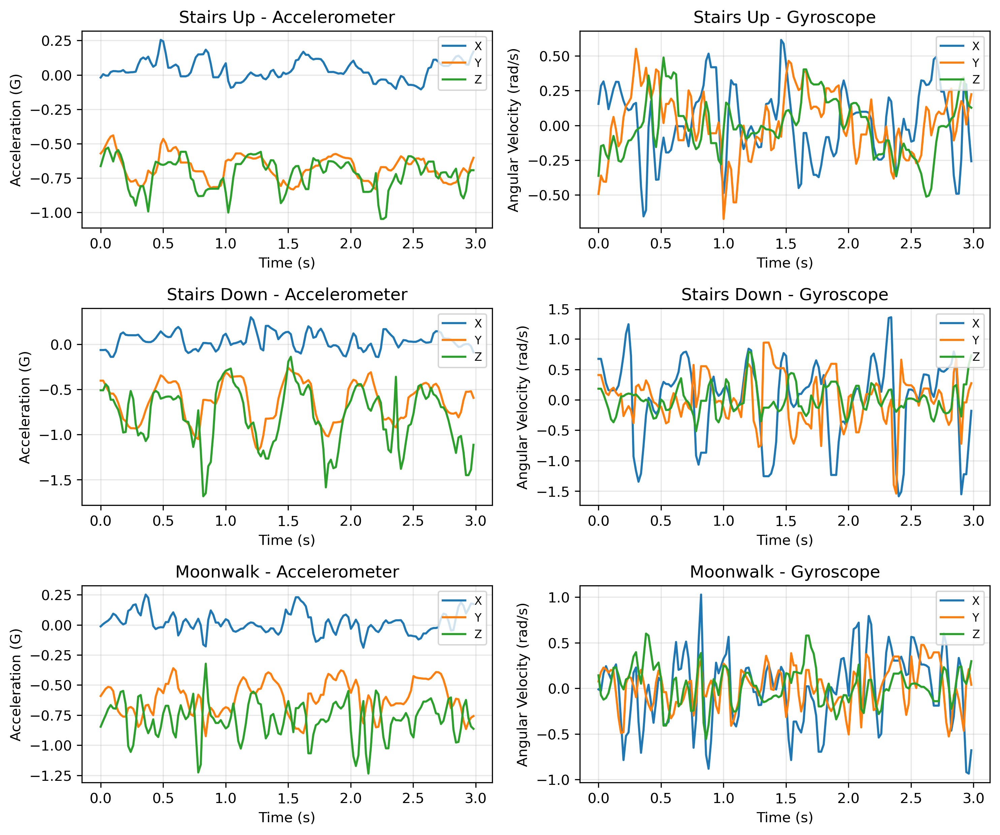

# HARmony ✨

> 🥇 Best Award - Ranked 1st in the course.

HARmony is a high-performance, real-time Human Activity Recognition (HAR) application for iOS. It uses built-in smartphone sensors (accelerometer & gyroscope) to classify human activities like walking, climbing stairs, and moonwalking.

Project Page: https://jeonghoonpark.com/project/harmony

https://github.com/user-attachments/assets/8f2721d0-d26c-4be7-a1b5-bb688907dcb5

  
  

Sensor previews from the analysis pipeline show synchronized accelerometer and gyroscope patterns across representative activity groups.

## Key Features

- **Real-time Activity Detection**: High-density inference using optimized rule-based classification.
- **Sensor Data Collection**: Record synchronized inertial data (acc + gyro) for further tuning.
- **Live Visualization**: Smooth chart representation of raw sensor signals.
- **Optimized for iOS**: Pure Swift implementation with focus on battery efficiency and responsiveness.

## How to Reproduce

1. **Open in Xcode**
   - Double-click `HARmony.xcodeproj` to open the project.
   - Recommended version: **Xcode 15+**.

2. **Configure Signing**
   - Open `Config.xcconfig` and update `DEVELOPMENT_TEAM` and `PRODUCT_BUNDLE_IDENTIFIER` with your own details.

3. **Build and Run**
   - Select a physical iPhone (recommended for sensor access) or a Simulator.
   - Press **Cmd + R** to build and run.

## Project Structure

- `ActivityClassifier.swift`: The core logic for rule-based motion classification.
- `MotionManager.swift`: Handles communication with CoreMotion and provides synchronized sampling.
- `CollectView.swift`: UI for recording sensor data with automated countdowns.
- `DetectView.swift`: Real-time activity recognition interface.
- `analysis/`: Sensor analysis scripts, results, and report figures.
