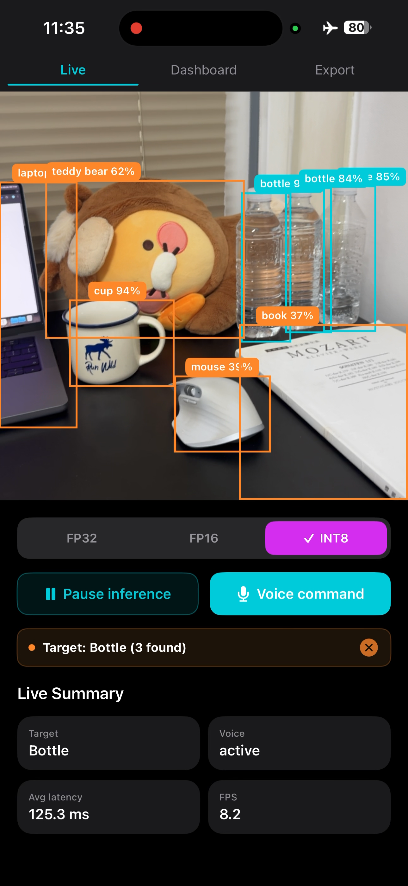
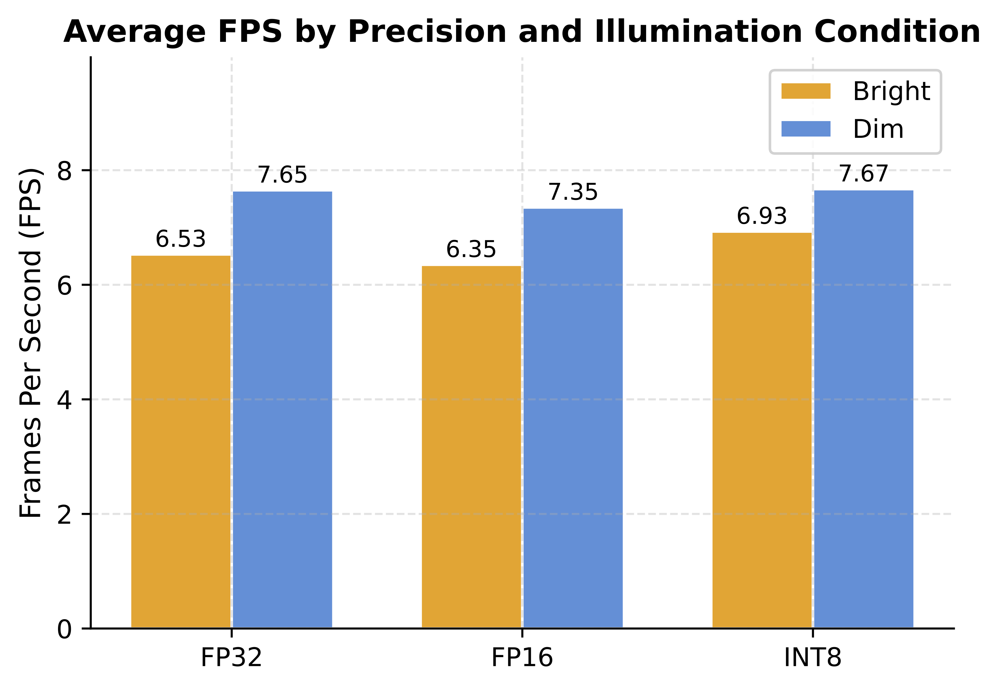

# doYOLOngo ✨

Project Page: https://jeonghoonpark.com/project/doYOLOngo

doYOLOngo is a high-performance, real-time object detection application for iOS. It combines the power of YOLO (You Only Look Once) with natural voice commands, allowing users to interact with their environment through their camera and microphone.

https://github.com/user-attachments/assets/0300fa75-6a0d-4395-b54b-dd1725f4f051

<p align="center">
  
  
</p>

The application utilizes optimized TFLite models to perform on-device inference, ensuring maximum privacy and low-latency performance.

### Inference performance by precision and illumination condition

- iPhone 15 Pro Max

| Condition | Precision | FPS  | Avg Lat. (ms) | p95 Lat. (ms) | Obj./Frame | Mem. (MB) |
|----------|----------|------|---------------|---------------|------------|-----------|
| Bright   | FP32     | 9.06 | 109.42        | 114.80        | 8.18       | 118.9     |
| Bright   | FP16     | 8.65 | 114.32        | 117.48        | 8.23       | 138.8     |
| Bright   | INT8     | 9.13 | 103.81        | 107.01        | 8.14       | 109.8     |
| Dim      | FP32     | 8.54 | 116.34        | 119.52        | 7.45       | 119.1     |
| Dim      | FP16     | 8.19 | 120.41        | 124.09        | 6.88       | 138.8     |
| Dim      | INT8     | 8.86 | 109.06        | 112.76        | 6.71       | 109.9     |


## Key Features

- **Voice-Driven Search**: Locate specific objects in your environment using voice commands (e.g., "Find the bottle").
- **Real-time Detection**: High-density inference using optimized YOLO models (FP32, FP16, and INT8).
- **Live Benchmarking**: Compare performance metrics (Latency, FPS) across different model precisions in real-time.
- **Session Analysis**: Log detection events and export session data for performance evaluation.
- **Premium UI/UX**: Modern, fluid interface with smooth transitions and real-time visualization.

## How to Reproduce

Run the commands from this README's directory.

1. **Install Dependencies**
   - If you don't have CocoaPods, install it via Homebrew:
   ```bash
   brew install cocoapods
   ```
   - Then run the following command to link dependencies:
   ```bash
   pod install
   ```
   - The `Pods/` directory is intentionally not committed. This command recreates CocoaPods dependencies from `Podfile` and `Podfile.lock`, including `TensorFlowLiteC`.

2. **Open in Xcode**
   - Open `doYOLOngo.xcworkspace` (not the `.xcodeproj`).
   - Use an Xcode version that supports the configured iOS deployment target.

3. **Configure Signing**
   - Select the `doYOLOngo` target.
   - Under **Signing & Capabilities**, select your Team and update the **Bundle Identifier** if necessary.

4. **Build and Run**
   - Select a physical iPhone (required for camera and sensor access).
   - Press **Cmd + R** to build and run.

## Project Structure

- `Podfile` / `Podfile.lock`: CocoaPods dependency definition and locked versions for reproducible installs.
- `Services/YOLOInferenceService.swift`: Core engine for TFLite model loading and inference.
- `Services/VoiceService.swift`: Handles speech-to-text and command processing logic.
- `Services/CameraService.swift`: Manages the AVFoundation camera session and frame processing.
- `Views/Live/`: The primary AR-style interface for real-time detection and voice feedback.
- `Views/Benchmark/`: Tools for comparing FP32, FP16, and INT8 model performance.
- `Models/COCOClasses.swift`: Metadata for the 80 object classes detectable by the model.
