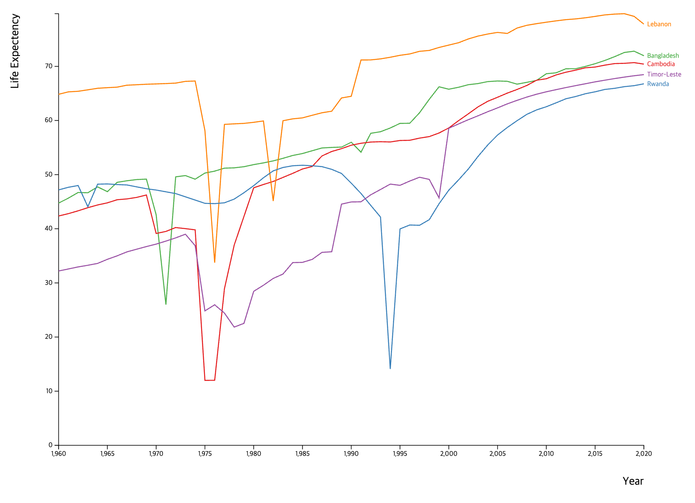

## Midterm

### Problem 1: Fix the Multiple-Line Chart Implementation

| Resource | Path |
|---|---|
| Source | [problem1](problem1/) |
| Entry file | [problem1/index.html](problem1/index.html) |

### Problem 2: Drawing Bubble Chart

| Resource | Path |
|---|---|
| Source | [problem2](problem2/) |
| Entry file | [problem2/index.html](problem2/index.html) |

Each problem folder has its own `package.json`. Run `npm install` and `npm start` inside the problem folder when a local server is required.
