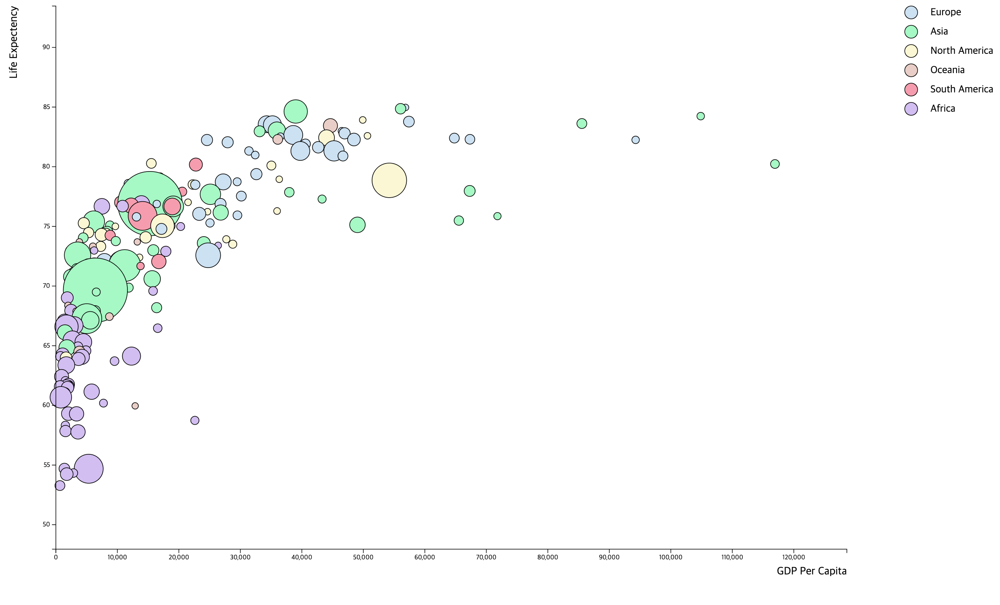

## Midterm Problem 2: Drawing Bubble Chart



## Files

| Resource | Path |
|---|---|
| Entry file | [index.html](index.html) |
| Main script | [js/main.js](js/main.js) |
| Package file | [package.json](package.json) |

## Run Locally

```bash
npm install
npm start
```

Then open [http://localhost:3000](http://localhost:3000).
